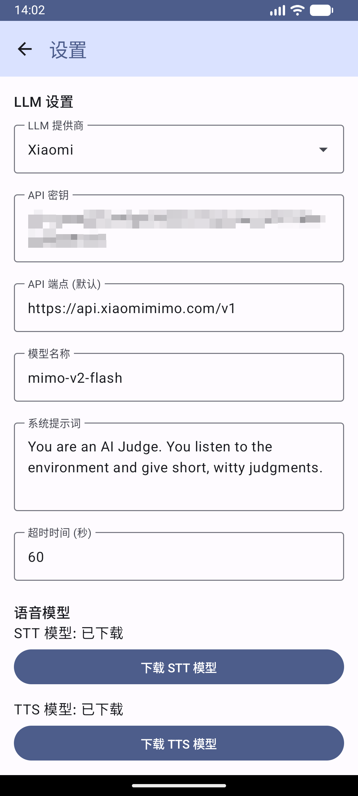

# AI Judge (AI 判官)

AI Judge is an Android application that acts as an unbiased, conversational observer. It listens to speech in your environment, transcribes it using on-device Speech-to-Text (STT), consults an AI "Judge" (LLM) for an opinion or verdict, and speaks the response back using on-device Text-to-Speech (TTS).

## Screenshots

  
  

## Features

- **On-device Speech Recognition**: Powered by [Sherpa-onnx](https://github.com/k2fsa/sherpa-onnx) for real-time, privacy-focused transcription.
- **AI Judgment**: Integrates with OpenAI-compatible LLM APIs (OpenAI, DeepSeek, Doubao, etc.) to analyze conversations.
- **Voice Output**: The Judge speaks its verdict aloud using Sherpa-onnx VITS TTS.
- **Internationalization**: Full support for English and Chinese (Simplified).
- **Customizable**: Extensive settings for LLM endpoints, API keys, system prompts, and request timeouts.
- **Automatic Model Download**: Built-in manager to download required ONNX models directly from Hugging Face.

## Tech Stack

- **Language**: [Kotlin](https://kotlinlang.org/)
- **UI**: [Jetpack Compose](https://developer.android.com/jetpack/compose) with Material 3
- **Architecture**: MVVM (Model-View-ViewModel)
- **Speech Engines**: [Sherpa-onnx](https://github.com/k2fsa/sherpa-onnx) (Streaming STT & VITS TTS)
- **Networking**: [Retrofit](https://square.github.io/retrofit/) & OkHttp

## Getting Started

### 1. Installation
1. Clone this repository.
2. Open the project in **Android Studio** (Ladybug or later recommended).
3. Build and run the app on an Android device (Physical device recommended for microphone performance).

### 2. Model Setup
The app requires ONNX models for STT and TTS:
- Navigate to **Settings**.
- Use the **Download STT Model** and **Download TTS Model** buttons to fetch the models automatically.
- Alternatively, you can manually place models in the app's internal storage (`/data/data/win.liuping.aijudge/files/`).

### 3. LLM Configuration
1. Obtain an API Key from an OpenAI-compatible provider.
2. Open the app **Settings**.
3. Select your **Provider** or choose **Custom**.
4. Enter your **API Key** and **Endpoint**.
5. Adjust the **Timeout** (default 60s) if using slower models.

## Usage
1. Grant **Microphone** permission when prompted.
2. Tap the **LISTEN** button on the home screen.
3. Speak or let the app listen to a conversation.
4. The app will detect speech endpoints and automatically send the text to the AI Judge.
5. Tap on any Judge response to hear it again.

## Development

### GitHub Actions
The project includes a `Manual Release` workflow. You can trigger it from the **Actions** tab to build a release APK and create a GitHub release.

### Build Requirements
- **JDK**: 17+
- **Android SDK**: API 34+
- **Gradle**: 8.2+

## License
[MIT License](LICENSE)