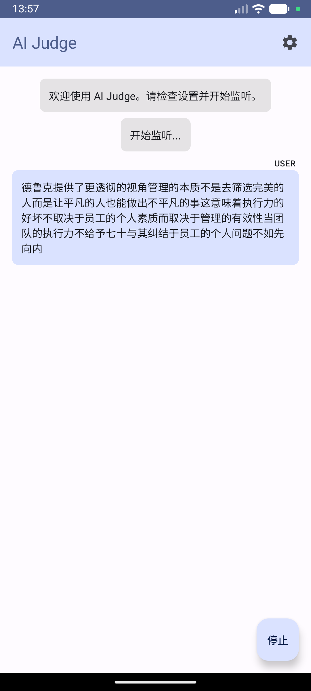

# AI Judge (AI 判官)

AI Judge 是一款 Android 应用，充当公正的对话观察者。它监听环境中的语音，使用端侧语音识别（STT）进行转录，咨询 AI "判官"（LLM）获取意见或裁决，并使用端侧语音合成（TTS）将回复朗读出来。

## 截图

<p align="center">
  
  
</p>

## 功能特性

- **端侧语音识别**：基于 [Sherpa-onnx](https://github.com/k2fsa/sherpa-onnx) 实现实时、隐私友好的语音转录
- **说话人分离**：自动识别不同说话人，支持设置别名
- **智能标点**：使用 CT-Transformer 模型自动添加标点符号
- **AI 裁判**：集成 OpenAI 兼容的 LLM API（OpenAI、DeepSeek、豆包等）分析对话
- **语音输出**：判官使用 Sherpa-onnx VITS TTS 朗读裁决
- **会话管理**：支持多会话保存、切换和管理
- **国际化**：完整支持中文和英文
- **高度可定制**：丰富的 LLM 端点、API 密钥、系统提示词和超时设置
- **自动模型下载**：内置管理器，直接从 Hugging Face 下载所需 ONNX 模型

## 技术栈

- **语言**：[Kotlin](https://kotlinlang.org/)
- **UI**：[Jetpack Compose](https://developer.android.com/jetpack/compose) + Material 3
- **架构**：MVVM（Model-View-ViewModel）
- **语音引擎**：[Sherpa-onnx](https://github.com/k2fsa/sherpa-onnx)（流式 STT & VITS TTS）
- **网络**：[Retrofit](https://square.github.io/retrofit/) & OkHttp

---

## 语音处理流程

### 整体架构

```
┌─────────────────────────────────────────────────────────────────────────────┐
│                              AI Judge 系统架构                               │
├─────────────────────────────────────────────────────────────────────────────┤
│                                                                             │
│   ┌──────────┐    ┌──────────────┐    ┌──────────────┐    ┌──────────────┐ │
│   │          │    │              │    │              │    │              │ │
│   │  麦克风  │───▶│  SttManager  │───▶│ MainViewModel│───▶│ LlmRepository│ │
│   │          │    │              │    │              │    │              │ │
│   └──────────┘    └──────────────┘    └──────────────┘    └──────────────┘ │
│                          │                   │                    │        │
│                          │                   │                    │        │
│                          ▼                   ▼                    ▼        │
│                   ┌──────────────┐    ┌──────────────┐    ┌──────────────┐ │
│                   │ 流式语音识别  │    │   状态管理   │    │   LLM API   │ │
│                   │ 说话人识别    │    │   会话存储   │    │   调用      │ │
│                   │ 标点恢复      │    │   消息管理   │    │             │ │
│                   └──────────────┘    └──────────────┘    └──────────────┘ │
│                                              │                    │        │
│                                              │                    │        │
│                                              ▼                    │        │
│   ┌──────────┐    ┌──────────────┐    ┌──────────────┐           │        │
│   │          │    │              │    │              │◀──────────┘        │
│   │   扬声器 │◀───│  TtsManager  │◀───│   AI 回复    │                    │
│   │          │    │              │    │              │                    │
│   └──────────┘    └──────────────┘    └──────────────┘                    │
│                                                                             │
└─────────────────────────────────────────────────────────────────────────────┘
```

### 详细处理流程

#### 1. 语音输入处理流程

```
┌─────────────────────────────────────────────────────────────────────────────┐
│                           语音输入处理流程                                   │
└─────────────────────────────────────────────────────────────────────────────┘

     用户说话
         │
         ▼
┌─────────────────┐
│   AudioRecord   │  采集参数：16kHz, 单声道, PCM_16BIT
│   音频采集      │
└────────┬────────┘
         │ Short[] 音频缓冲
         ▼
┌─────────────────┐
│   格式转换      │  Short → Float (除以 32768.0)
│   归一化处理    │
└────────┬────────┘
         │ Float[] 音频样本
         │
         ├────────────────────────────────────┐
         │                                    │
         ▼                                    ▼
┌─────────────────┐                  ┌─────────────────┐
│ OnlineRecognizer│                  │  音频缓冲区     │
│ 流式语音识别    │                  │  (用于说话人ID) │
│                 │                  │                 │
│ • Streaming     │                  └────────┬────────┘
│   Zipformer     │                           │
│ • 实时解码      │                           │
└────────┬────────┘                           │
         │                                    │
         ▼                                    │
┌─────────────────┐                           │
│   端点检测      │  规则1: 静音 > N秒 (可配置)│
│   EndpointConfig│  规则2: 有文本后静音1.2秒 │
│                 │  规则3: 总时长 > 60秒     │
└────────┬────────┘                           │
         │                                    │
    ┌────┴────┐                               │
    │是否端点？│                               │
    └────┬────┘                               │
    是   │   否                               │
         │    └──▶ 继续流式输出中间结果        │
         ▼                                    │
┌─────────────────┐                           │
│ OfflinePunctuation                          │
│ 标点恢复        │  CT-Transformer int8 模型 │
│                 │  添加逗号、句号等标点     │
└────────┬────────┘                           │
         │                                    │
         ▼                                    ▼
┌─────────────────┐                  ┌─────────────────┐
│  输出最终文本   │                  │ SpeakerEmbedding│
│  (带标点)       │                  │ 说话人识别      │ (异步)
└────────┬────────┘                  │                 │
         │                           │ • 提取声纹特征  │
         │                           │ • 余弦相似度    │
         │                           │ • 阈值: 0.45   │
         │                           └────────┬────────┘
         │                                    │
         │◀───────────────────────────────────┘
         │        (异步回调更新说话人)
         ▼
┌─────────────────┐
│  发送到 LLM     │
└─────────────────┘
```

#### 2. 说话人识别流程

```
┌─────────────────────────────────────────────────────────────────────────────┐
│                           说话人识别流程                                     │
└─────────────────────────────────────────────────────────────────────────────┘

┌─────────────────┐
│ 一段语音结束    │
│ (端点检测触发)  │
└────────┬────────┘
         │
         ▼
┌─────────────────┐
│ SpeakerEmbedding│
│ Extractor       │  3DSpeaker 模型
│                 │
│ 提取 512 维     │
│ 声纹特征向量    │
└────────┬────────┘
         │
         ▼
┌─────────────────┐      ┌─────────────────┐
│ 计算余弦相似度  │◀────▶│   说话人注册表  │
│                 │      │                 │
│ 与所有已知说话人│      │ Speaker 1: [...]│
│ 的特征向量比较  │      │ Speaker 2: [...]│
│                 │      │ Speaker N: [...]│
└────────┬────────┘      └─────────────────┘
         │
         ▼
    ┌─────────────────┐
    │ 最高相似度 > 0.45?│
    └────────┬────────┘
        是   │   否
             │    │
             │    ▼
             │   ┌─────────────────┐
             │   │ 注册新说话人    │
             │   │ "Speaker N+1"   │
             │   │ 保存特征向量    │
             │   └────────┬────────┘
             │            │
             ▼            ▼
      ┌─────────────────────┐
      │ 返回说话人名称      │
      │ (可设置别名)        │
      └─────────────────────┘
```

#### 3. LLM 调用流程

```
┌─────────────────────────────────────────────────────────────────────────────┐
│                           LLM 调用流程                                       │
└─────────────────────────────────────────────────────────────────────────────┘

┌─────────────────┐
│ 用户消息        │
│ (带说话人标识)  │
└────────┬────────┘
         │
         ▼
┌─────────────────┐
│ 构建消息历史    │  包含系统提示词 + 历史对话
│                 │
│ [System Prompt] │
│ [User: ...]     │
│ [Assistant: ...]│
│ [User: 新消息]  │
└────────┬────────┘
         │
         ▼
┌─────────────────┐
│ LlmRepository   │
│                 │
│ POST /v1/chat/  │
│ completions     │
│                 │
│ OpenAI 兼容格式 │
└────────┬────────┘
         │
         ▼
┌─────────────────┐
│ 支持的 Provider │
│                 │
│ • OpenAI        │
│ • Claude (代理) │
│ • Gemini (代理) │
│ • DeepSeek      │
│ • 豆包 (Doubao) │
│ • 小米          │
│ • 自定义        │
└────────┬────────┘
         │
         ▼
┌─────────────────┐
│ AI 判官回复     │
└────────┬────────┘
         │
         ├─────────────────────┐
         │                     │
         ▼                     ▼
┌─────────────────┐   ┌─────────────────┐
│ 显示在聊天界面  │   │ TTS 语音合成    │
└─────────────────┘   └─────────────────┘
```

#### 4. 语音合成流程

```
┌─────────────────────────────────────────────────────────────────────────────┐
│                           语音合成 (TTS) 流程                                │
└─────────────────────────────────────────────────────────────────────────────┘

┌─────────────────┐
│ AI 判官回复文本 │
└────────┬────────┘
         │
         ▼
┌─────────────────┐
│ OfflineTts      │
│ VITS 模型       │
│                 │
│ • vits-aishell3 │
│ • 中文语音合成  │
│ • 采样率可变    │
└────────┬────────┘
         │
         ▼
┌─────────────────┐
│ 音频后处理      │
│                 │
│ • 计算最大振幅  │
│ • 音量归一化    │
│ • 目标峰值 0.9  │
│ • 软削波处理    │
└────────┬────────┘
         │
         ▼
┌─────────────────┐
│ AudioTrack      │
│                 │
│ • MODE_STREAM   │
│ • 16bit PCM     │
│ • 单声道输出    │
└────────┬────────┘
         │
         ▼
┌─────────────────┐
│     扬声器      │
└─────────────────┘
```

### 完整数据流

```
┌─────────────────────────────────────────────────────────────────────────────┐
│                              完整数据流                                      │
└─────────────────────────────────────────────────────────────────────────────┘

  ┌─────┐
  │ 🎤  │ 麦克风
  └──┬──┘
     │ 音频流 (16kHz PCM)
     ▼
┌─────────────────────────────────────────────────────────────────────────────┐
│                              SttManager                                      │
│  ┌─────────────┐    ┌─────────────┐    ┌─────────────┐    ┌─────────────┐  │
│  │ AudioRecord │───▶│  Zipformer  │───▶│ 端点检测    │───▶│ 标点恢复    │  │
│  │             │    │  流式 ASR   │    │             │    │ CT-Trans    │  │
│  └─────────────┘    └─────────────┘    └─────────────┘    └──────┬──────┘  │
│         │                                                        │          │
│         │           ┌─────────────┐                              │          │
│         └──────────▶│ 3DSpeaker   │ (异步)                       │          │
│                     │ 说话人识别  │────────────────────┐         │          │
│                     └─────────────┘                    │         │          │
└─────────────────────────────────────────────────────────│─────────│──────────┘
                                                         │         │
                                                         ▼         ▼
                                                    ┌─────────────────┐
                                                    │  MainViewModel  │
                                                    │                 │
                                                    │ • 消息管理      │
                                                    │ • 会话管理      │
                                                    │ • 状态协调      │
                                                    └────────┬────────┘
                                                             │
                                                             ▼
                                                    ┌─────────────────┐
                                                    │ LlmRepository   │
                                                    │                 │
                                                    │ HTTP POST       │
                                                    │ /v1/chat/       │
                                                    │ completions     │
                                                    └────────┬────────┘
                                                             │
                                                             ▼
                                                    ┌─────────────────┐
                                                    │   LLM Server    │
                                                    │  (云端 API)     │
                                                    └────────┬────────┘
                                                             │ AI 回复
                                                             ▼
┌─────────────────────────────────────────────────────────────────────────────┐
│                              TtsManager                                      │
│  ┌─────────────┐    ┌─────────────┐    ┌─────────────┐    ┌─────────────┐  │
│  │ VITS 合成   │───▶│ 音量归一化  │───▶│ PCM 编码    │───▶│ AudioTrack  │  │
│  │             │    │             │    │             │    │             │  │
│  └─────────────┘    └─────────────┘    └─────────────┘    └──────┬──────┘  │
└─────────────────────────────────────────────────────────────────────│────────┘
                                                                      │
                                                                      ▼
                                                                  ┌─────┐
                                                                  │ 🔊  │ 扬声器
                                                                  └─────┘
```

---

## ONNX 模型说明

| 模型 | 用途 | 大小 | 下载源 |
|------|------|------|--------|
| Streaming Zipformer | 流式语音识别 (STT) | ~80MB | Hugging Face |
| VITS-AISHELL3 | 中文语音合成 (TTS) | ~115MB | Hugging Face |
| 3DSpeaker | 说话人识别 | ~40MB | GitHub |
| CT-Transformer int8 | 标点恢复 | ~75MB | GitHub |

模型存储路径：`/data/data/win.liuping.aijudge/files/`

```
files/
├── stt-model/
│   ├── encoder-epoch-99-avg-1.onnx
│   ├── decoder-epoch-99-avg-1.onnx
│   ├── joiner-epoch-99-avg-1.onnx
│   └── tokens.txt
├── tts-model/
│   ├── vits-aishell3.onnx
│   ├── tokens.txt
│   └── lexicon.txt
├── diarization-model/
│   └── speaker_model.onnx
└── punctuation-model/
    └── model.int8.onnx
```

---

## 快速开始

### 1. 安装
1. 克隆此仓库
2. 使用 **Android Studio**（推荐 Ladybug 或更新版本）打开项目
3. 在 Android 设备上构建并运行（推荐使用真机以获得更好的麦克风性能）

### 2. 模型设置
应用需要 ONNX 模型来运行 STT 和 TTS：
- 进入 **设置** 页面
- 使用 **下载 STT 模型** 和 **下载 TTS 模型** 按钮自动获取模型
- 也可以手动将模型放置在应用内部存储中

### 3. LLM 配置
1. 从 OpenAI 兼容的服务商获取 API 密钥
2. 打开应用 **设置**
3. 选择 **服务商** 或选择 **自定义**
4. 输入 **API 密钥** 和 **端点**
5. 根据需要调整 **超时时间**（默认 60 秒）

---

## 使用方法

1. 首次启动时授予 **麦克风** 权限
2. 点击主界面的 **监听** 按钮
3. 开始说话或让应用监听对话
4. 应用会检测语音端点，自动将文本发送给 AI 判官
5. 点击任意判官回复可重新播放

---

## 开发

### 构建要求
- **JDK**: 17+
- **Android SDK**: API 34+
- **Gradle**: 8.2+

### GitHub Actions
项目包含 `Manual Release` 工作流。可以从 **Actions** 标签页触发，构建 Release APK 并创建 GitHub Release。

---

## 项目结构

```
app/src/main/java/win/liuping/aijudge/
├── data/
│   ├── model/           # 数据模型 (AppSettings, Session, Message)
│   └── repository/      # 数据仓库 (Settings, Session, LLM)
├── speech/
│   ├── SttManager.kt    # 语音识别管理器
│   └── TtsManager.kt    # 语音合成管理器
├── ui/
│   ├── ChatScreen.kt    # 聊天界面
│   ├── SettingsScreen.kt # 设置界面
│   └── dialogs/         # 对话框组件
├── util/
│   └── ModelDownloadManager.kt # 模型下载管理器
├── viewmodel/
│   └── MainViewModel.kt # 主视图模型
└── MainActivity.kt      # 主 Activity
```

---

## 许可证

[MIT License](LICENSE)
